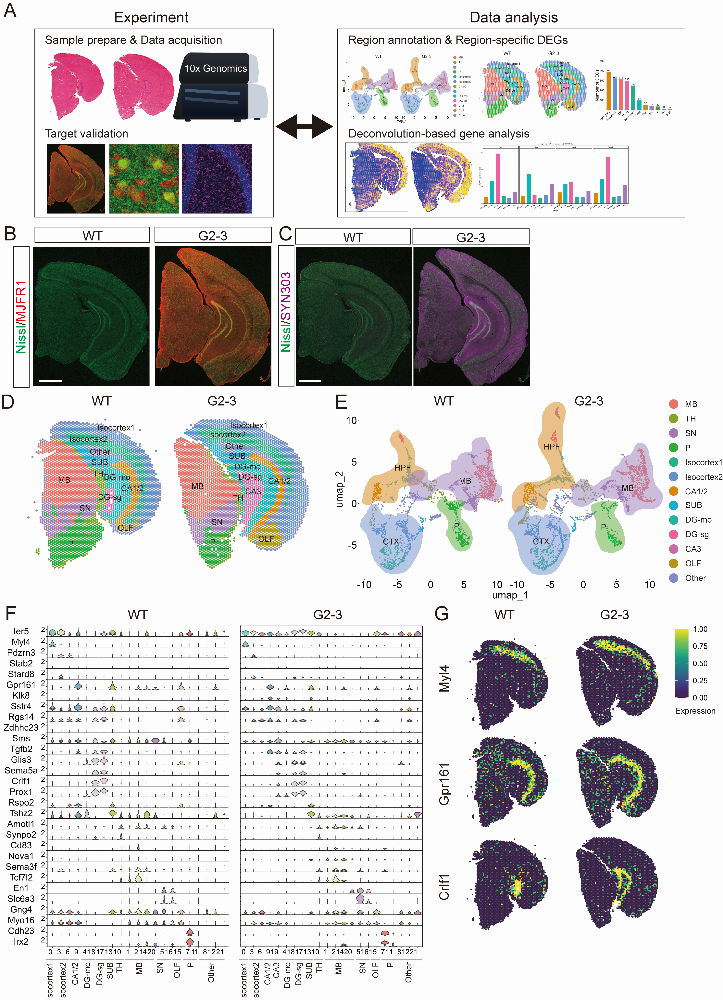

# Spatial transcriptomics links hippocampal synaptic remodeling to microglial phagocytosis in synucleinopathy
This repository contains core analysis scripts used for spatial transcriptomics data analysis in the G2-3 α-synuclein transgenic and WT mouse. The scripts focus on region annotation, differential expression analysis, functional enrichment, and region-matched cell-type deconvolution.

## Graphical summary

## Repository overview

| Script                           | Description                                                                                                                                                                                                                                                                                                                                                             |
| -------------------------------- | ----------------------------------------------------------------------------------------------------------------------------------------------------------------------------------------------------------------------------------------------------------------------------------------------------------------------------------------------------------------------- |
| `00_region_annotation_summary.R` | Summary workflow for anatomical region assignment based on region-specific marker expression, marker overlap, and anatomical reference.                                                                                                                                                                                                                                 |
| `01_DEG_analysis.R`              | Differential expression analysis between G2-3 TG and WT samples within annotated regions.                                                                                                                                                                                                                                                                               |
| `02_enrichment_analysis.R`       | Gene Ontology Biological Process (GO BP) and KEGG enrichment analysis using region-specific DEG sets.                                                                                                                                                                                                                                                                   |
| `03_CARD_deconvolution.R`        | Region-matched deconvolution analysis using [CARD](https://github.com/YMa-lab/CARD) ([Ma and Zhou, *Nature Biotechnology*, 2022](https://doi.org/10.1038/s41587-022-01273-7)) with multiple [WMB-10X reference datasets](https://allen-brain-cell-atlas.s3.us-west-2.amazonaws.com/index.html#expression_matrices/WMB-10Xv3/20230630/) from the Allen Brain Cell Atlas. |

## Data availability
Raw and processed spatial transcriptomics data are available through GEO: [GSE326942](https://www.ncbi.nlm.nih.gov/geo/query/acc.cgi?acc=GSE326942)
